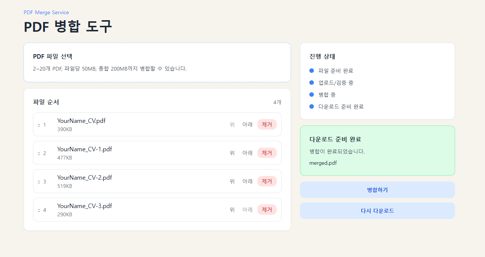

# 문서 설명

간단한 harness framework 를 사용하여 서비스를 구현할 수 있습니다.

> `/original` 브랜치에 codex 용도로 사용할 수 있는 harness framework 를 저장하였습니다.

## PDF merge tool
harness framework를 사용하여 PDF merge tool을 구현하였습니다.
다음 환경에서의 merge 기능을 제공합니다.
- WEB UI
- terminal

## 초기 디자인 및 기능

### 기능의 한계
- 드래그로 순서를 변경하는 기능이 없다.
- pdf를 미리보기 할 수 없어서, pdf 이름을 통해 순서를 추측해야한다.
